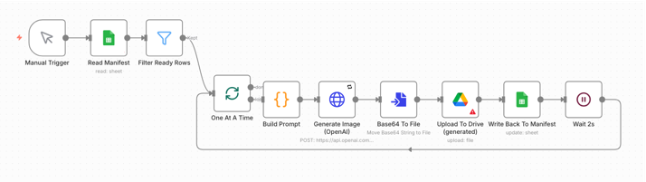
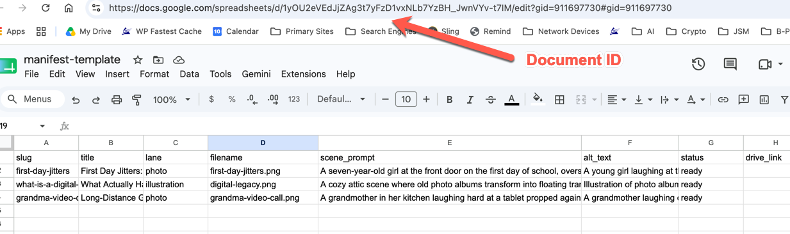

# n8n Blog Image Pipeline

Batch-generate blog hero images with n8n + the OpenAI image API, driven by a Google Sheet manifest, with a mandatory human review gate before anything ships.

Built in a day. Generated 28 hero images for roughly $5. The images are AI-generated; the taste decisions are not.

## Architecture

```
Google Sheet (manifest)
        |
        v
       n8n
        |
        v
OpenAI Images API (gpt-image-1)
        |
        v
Google Drive staging folder ("generated")
        |
        v
Human review  -->  approved folder
        |
        v
Manual copy into the website repo
```

n8n never touches the website repo. Nothing is published automatically. API keys live only in n8n's credential store.

---

# Setup

Setup has three parts, in this order:

1. **Google side** — create the manifest sheet and Drive folders, and collect two IDs
2. **n8n credentials** — connect OpenAI, Google Sheets, and Google Drive
3. **n8n nodes** — import the workflow and wire the IDs and mappings into it

Budget 30–45 minutes the first time, most of it on Google OAuth.

## Part 1: Google setup (sheet, folders, and the two IDs you need)

### 1a. Create the manifest sheet

The manifest is a Google Sheet — one row per image you want generated. n8n reads it to know what to make, and writes results back to it.

1. Go to [sheets.google.com](https://sheets.google.com) and create a blank spreadsheet. Name it something like `Image Manifest`.
2. Import the template: **File → Import → Upload**, choose `manifest-template.csv` from this repo, and select **Replace spreadsheet** when asked.
3. **Note the tab name.** After a CSV import, the tab at the bottom is named after the file (e.g. `manifest-template`), NOT `Sheet1`. This matters later — n8n must select this tab from a dropdown, and typing "Sheet1" will fail.

**What goes in each row** (the template includes three worked examples):

| Column | What to put there |
|---|---|
| `slug` | A short unique ID, like `first-day-jitters`. Used to match write-backs — must be unique per row. |
| `title` | The blog post title. For your reference only. |
| `lane` | `photo` for human-story images, `illustration` for conceptual ones. |
| `filename` | The output filename, e.g. `first-day-jitters.png`. |
| `scene_prompt` | ALL the per-image creative direction: who is in frame, their emotion and expression, the composition. This is where image quality is won or lost — see [The two-lane style system](#the-two-lane-style-system). |
| `alt_text` | Accessibility text you'll use on the website. |
| `status` | Set to `ready` for rows you want generated. The workflow only processes `ready` rows. |
| `drive_link` | Leave empty — the workflow fills it in. |

### 1b. Find the Sheet ID

Open your manifest sheet and look at the browser address bar:

```
https://docs.google.com/spreadsheets/d/1AbC2dEfG3hIjK4lMnO5pQrS6tUvW7xYz/edit#gid=0
                                      \_______________________________/
                                            this is the Sheet ID
```

The Sheet ID is the long string between `/d/` and `/edit`. Copy it somewhere — you'll paste it into **two** n8n nodes in Part 3.



### 1c. Create the Drive folders

1. In [Google Drive](https://drive.google.com), create a parent folder (e.g. `Blog Images`).
2. Inside it, create two subfolders: `generated` (where n8n uploads everything) and `approved` (where YOU move the keepers after review).

### 1d. Find the Folder ID

Open the `generated` folder in Drive and look at the address bar:

```
https://drive.google.com/drive/folders/1XyZ9aBcD8eFgH7iJkL6mNoP
                                       \______________________/
                                          this is the Folder ID
```

The Folder ID is everything after `/folders/`. Copy it — it goes into the Drive upload node in Part 3. (You don't need the `approved` folder's ID; moving files there is a manual review step by design.)

## Part 2: n8n credentials

You'll create three credentials in n8n (**left sidebar → Credentials → Add credential**). The workflow ships with `REPLACE_ME_AFTER_IMPORT` placeholders — after import, each node needs one of these real credentials attached.

### 2a. OpenAI API key

1. At [platform.openai.com](https://platform.openai.com), open **Settings → API keys** and create a new secret key.
2. In n8n, add a credential of type **OpenAI** (or a generic **Header Auth** credential with header name `Authorization` and value `Bearer YOUR_KEY`, matching how the HTTP Request node is configured).
3. Before your first run, confirm three things in your OpenAI account, because any one of them can block `gpt-image-1` (see Troubleshooting — all three happened during this build):
   - Your **organization is verified** (Settings → Organization → complete the ID check).
   - Your project's **model allowlist** includes `gpt-image-1` (or allows all models).
   - Your API key was **created after** verification. Keys minted before verification may never gain access — mint a fresh one.

### 2b. Google OAuth (Sheets and Drive)

This is the fiddliest part, and it differs by how you run n8n.

**If you use n8n Cloud:** easy mode. Add a **Google Sheets OAuth2** credential, click **Sign in with Google**, approve the permissions, done. Repeat for **Google Drive OAuth2**. n8n Cloud provides the OAuth app; you just log in.

**If you self-host n8n:** you must create your own Google OAuth app first:

1. Go to [console.cloud.google.com](https://console.cloud.google.com) and create a project (any name).
2. **Enable the APIs:** APIs & Services → Library → search for and enable both **Google Sheets API** and **Google Drive API**.
3. **Configure the consent screen:** APIs & Services → OAuth consent screen. Choose **External**, fill in the app name and your email, and add yourself as a test user.
4. **Create credentials:** APIs & Services → Credentials → Create Credentials → **OAuth client ID** → type **Web application**. n8n shows you the exact **redirect URI** to paste in when you start creating the n8n credential — copy it from n8n's credential screen into the Google form's "Authorized redirect URIs".
5. Copy the resulting **Client ID** and **Client Secret** into the n8n credential, then click **Sign in with Google**.
6. **Important:** in the OAuth consent screen settings, click **Publish app** (moving it out of "Testing" status). A consent screen left in Testing expires your refresh tokens **every 7 days**, and your workflow will start failing weekly with "authorization grant invalid/expired/revoked."

Create the credential twice — once for Sheets, once for Drive (same Google Cloud app can back both).

## Part 3: n8n node configuration

### 3a. Import the workflow

In n8n: **Workflows → Add workflow → Import from file** → select `workflow.json` from this repo.

The imported chain looks like this:

```
Manual Trigger
  → Google Sheets (read manifest)
  → Filter (status = ready)
  → SplitInBatches (1 at a time)
  → Code: "Build Prompt" (append per-lane style block)
  → HTTP Request: POST https://api.openai.com/v1/images/generations
      model: gpt-image-1 | size: 1536x1024 | quality: high
      response: base64 | 3 retries | 180s timeout
  → Convert base64 → binary PNG (filename from the row)
  → Google Drive upload (staging folder)
  → Google Sheets write-back (match on slug; set status=generated + drive_link)
  → Wait 2s
  → loop
```

### 3b. Attach credentials

Open each node that shows a credential warning (both Sheets nodes, the Drive node, the HTTP Request node) and select the credential you created in Part 2 from its dropdown.

### 3c. Wire in the Sheet ID — in BOTH Sheets nodes

Open the **Google Sheets read** node AND the **Google Sheets write-back** node. In each, replace `REPLACE_ME_SHEET_DOCUMENT_ID` with your Sheet ID from step 1b. Missing the second node is a classic silent failure — generation works, but results never land back in the sheet.

### 3d. Pick the sheet tab From-list, not By-Name

In both Sheets nodes, the **Sheet** field has a mode selector. Choose **From list** and pick your tab from the dropdown. Do NOT use By-Name with "Sheet1" — after a CSV import that tab doesn't exist (step 1a), and you'll get "Sheet1 not found."

### 3e. Wire in the Folder ID

Open the **Google Drive upload** node and replace `REPLACE_ME_GENERATED_FOLDER_ID` with your `generated` Folder ID from step 1d.

### 3f. Check the write-back mapping

In the **Sheets write-back** node:

- **Column to Match On** must be set to `slug`. (If you ever point the node at a different spreadsheet, this mapping silently resets — re-set it after any document change.)
- The mapped value fields (`status`, `drive_link`) must be in **Expression mode**. The tell: a resolved preview appears under the field. If you paste `{{ }}` into a field in fixed mode, it sends the literal braces to the sheet and the loop halts after image one.

### 3g. Customize the "Build Prompt" Code node

Open the Code node. The style blocks at the top contain `[BRACKETED]` placeholders for your brand palette, setting, and mood — the embedded comments walk you through what to change and what to leave alone. This is where series consistency comes from, so do this before generating anything you intend to keep.

### 3h. Pilot run

Set only **5 rows** to `ready` for your first run. API rendering can differ from chat-UI rendering with identical prompts — validate the look before spending on the full batch.

---

## Running it

1. Fill manifest rows; set status to `ready`.
2. Hit **Execute workflow** on the Manual Trigger in n8n.
3. Watch the `generated` folder fill. ~20–40s per image; a 28-image run takes ~12–17 minutes with the 2-second spacing.
4. Review in Drive: move keepers to `approved`, flip rejects back to `ready` in the sheet (edit the scene prompt if needed), and re-run — only `ready` rows are processed, so approved work is never touched.
5. Manually copy approved images into your site repo.

## The two-lane style system

Series consistency does not require one uniform style. It requires a consistent *palette, light, and mood*. This pipeline uses two lanes:

- **`photo`** — photorealistic, for human-story posts
- **`illustration`** — warm textured illustration, for conceptual posts that don't photograph well

The `lane` column selects one of two style blocks defined in the single "Build Prompt" Code node. The style block is appended identically to every request, so there is zero prompt drift across the series. Per-image direction lives entirely in `scene_prompt`.

**Key lesson:** image "policy" lives in the prompts, not in model settings. Between our worst run (technically perfect, emotionally dead) and our best run, nothing in the workflow changed — only the words. Scene prompts that name who's in frame and direct the emotion ("gap-toothed first-day grin," "mid-laugh") are what separate "contains a face" from "alive."

## Cost & timing

- ~20–40 seconds per image at 1536×1024, high quality
- Cost depends entirely on your GPT and what plan or pay-per-use rate you're using.

## Troubleshooting (every one of these was actually hit)

**OpenAI: "project does not have access to model gpt-image-1."** This can be *three stacked causes*, and fixing one may not be enough:
1. Organization not verified — complete the ID check in OpenAI settings (takes minutes).
2. The project's model **allowlist** excludes the model — add it in project settings.
3. An API key minted *before* verification never inherits the new entitlement — mint a **fresh key**. This was the final fix.

**Google Drive OAuth: "authorization grant invalid / expired / revoked."** The refresh token is dead; delete and recreate the credential. Self-hosted n8n: if your Google consent screen is still in "Testing" status, refresh tokens expire **every 7 days** — publish the consent screen (Part 2b, step 6).

**"Column to Match On is required."** Swapping the manifest to a new spreadsheet silently **wipes the Sheets node's column mapping**. Re-map (match on `slug`) after any document change.

**Loop halts after image one, with literal `{{ }}` values in the sheet.** A write-back field is in fixed mode. Toggle it to **Expression mode**; confirm you see a resolved preview under the field.

**"Sheet1 not found" after CSV import.** The tab is named after the imported file. Pick the tab via **From list**, not By-Name.

## Sample outputs

Two sample images are in `samples/` — one from each lane. All outputs are AI-generated (OpenAI gpt-image-1) and reviewed by a human before use.

## License

see `LICENSE`.
